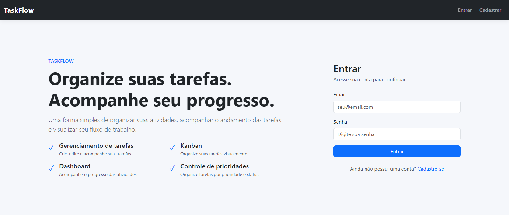
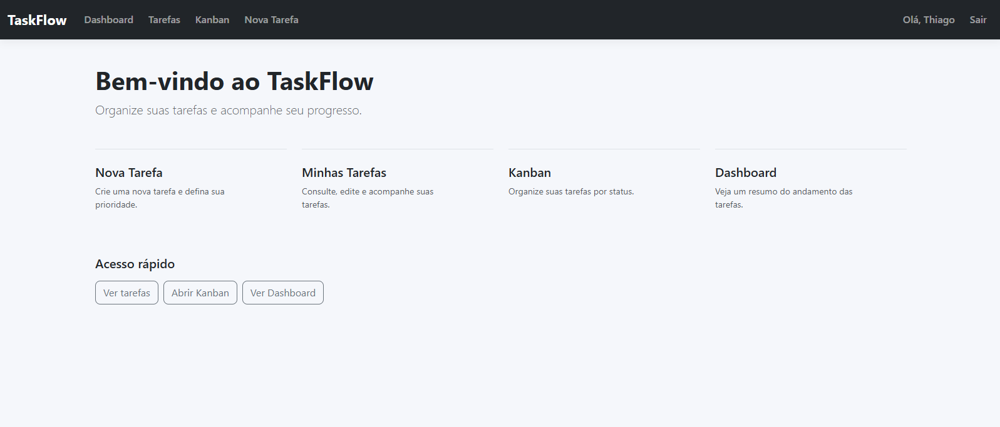
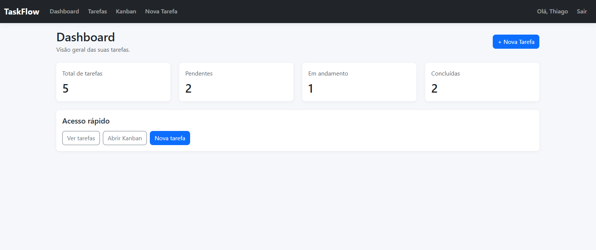
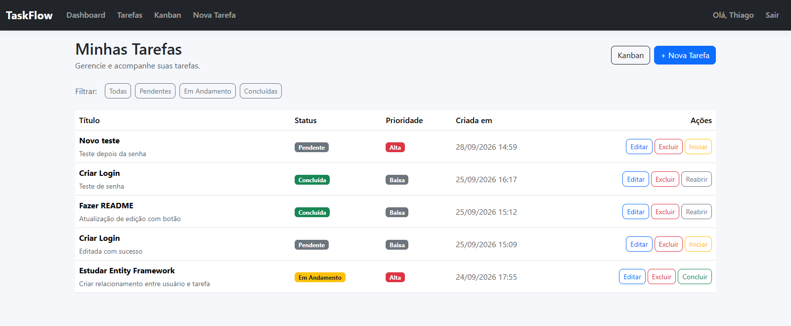
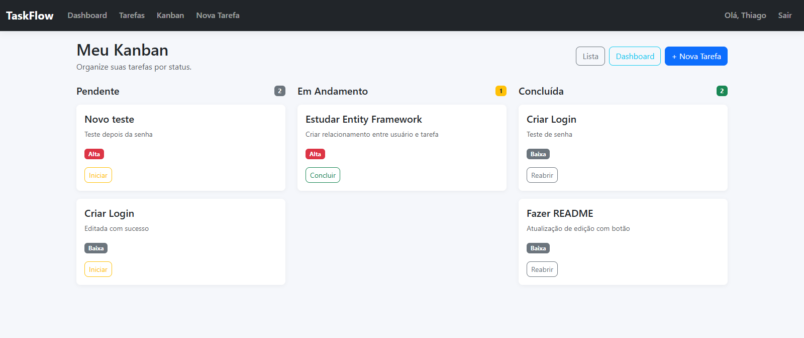

# TaskFlow

Sistema web de gerenciamento de tarefas desenvolvido com **C# e ASP.NET Core**, com autenticação de usuários, gerenciamento de tarefas, dashboard e organização visual em Kanban.

O projeto foi desenvolvido como parte do meu processo de aprendizado e prática em desenvolvimento de aplicações web com .NET.

## Funcionalidades

* Cadastro de usuários
* Login e logout
* Autenticação baseada em cookies
* Senhas armazenadas com hash utilizando BCrypt
* Criação de tarefas
* Edição de tarefas
* Exclusão de tarefas
* Controle de prioridades
* Controle de status das tarefas
* Filtro de tarefas por status
* Dashboard com resumo das tarefas
* Kanban com organização por status
* Movimentação de tarefas entre colunas por drag and drop
* API REST para atualização do status das tarefas
* Isolamento das tarefas por usuário autenticado

## Tecnologias

* **C#**
* **ASP.NET Core MVC**
* **.NET 10**
* **Entity Framework Core**
* **MySQL**
* **REST API**
* **Bootstrap**
* **HTML5**
* **CSS3**
* **JavaScript**
* **BCrypt**
* **Git**

## Estrutura do projeto


TaskFlow/
├── Controllers/
├── Data/
├── Migrations/
├── Models/
├── Views/
├── wwwroot/
│   ├── css/
│   └── js/
├── Program.cs
├── appsettings.json
└── TaskFlow.csproj


## Autenticação

O sistema utiliza autenticação baseada em cookies.

As senhas dos usuários não são armazenadas em texto puro. Durante o cadastro, a senha é transformada em um hash utilizando **BCrypt**.

As tarefas também são vinculadas ao usuário autenticado, garantindo que cada usuário visualize e gerencie apenas suas próprias tarefas.

## API REST

O TaskFlow possui uma API REST integrada à aplicação para atualização do status das tarefas.

Endpoint utilizado pelo Kanban:

http
PUT /api/tarefas/{id}/status


A API valida o usuário autenticado, verifica a tarefa e atualiza seu status.

A movimentação das tarefas no Kanban utiliza JavaScript para realizar a chamada à API sem a necessidade de enviar o formulário tradicionalmente.

## Banco de dados

O projeto utiliza **MySQL** como banco de dados e **Entity Framework Core** para o mapeamento e gerenciamento das entidades.

Principais tabelas:

* `Usuarios`
* `Tarefas`
* `__EFMigrationsHistory`

As alterações da estrutura do banco são controladas por meio de **Entity Framework Migrations**.

## Configuração

A string de conexão do banco de dados não fica armazenada diretamente no código versionado.

Durante o desenvolvimento local, o projeto utiliza **ASP.NET Core User Secrets** para armazenar informações sensíveis, como a senha do banco de dados.

Para configurar os User Secrets:

```bash
dotnet user-secrets init
```

Depois, configure a conexão:

```bash
dotnet user-secrets set "ConnectionStrings:DefaultConnection" "server=127.0.0.1;port=3306;database=TaskFlowDB;user=root;password=SUA_SENHA"
```

> Substitua `SUA_SENHA` pela senha utilizada no ambiente local.

## Como executar o projeto

### Pré-requisitos

* .NET SDK
* MySQL
* Git

### 1. Clone o repositório

```bash
git clone URL_DO_REPOSITORIO
```

### 2. Acesse a pasta do projeto

```bash
cd TaskFlow
```

### 3. Configure o User Secrets

```bash
dotnet user-secrets init
```

```bash
dotnet user-secrets set "ConnectionStrings:DefaultConnection" "server=127.0.0.1;port=3306;database=TaskFlowDB;user=root;password=SUA_SENHA"
```

### 4. Execute as migrations

```bash
dotnet ef database update
```

### 5. Execute a aplicação

```bash
dotnet run
```

A aplicação estará disponível no endereço informado pelo terminal.

## Interface

O TaskFlow possui uma interface responsiva desenvolvida com Bootstrap.

### Login



### Tela de Home



### Dashboard



### Gerenciamento de tarefas



### Kanban



## Próximos passos

Algumas melhorias planejadas para versões futuras:

* Melhorias no dashboard
* Busca de tarefas
* Paginação
* Evolução da API REST
* Melhorias na experiência do usuário
* Novos recursos de gerenciamento de tarefas

## Autor

**Thiago Passos**

Projeto desenvolvido para estudos, prática e construção de portfólio em desenvolvimento com **C#/.NET**.
